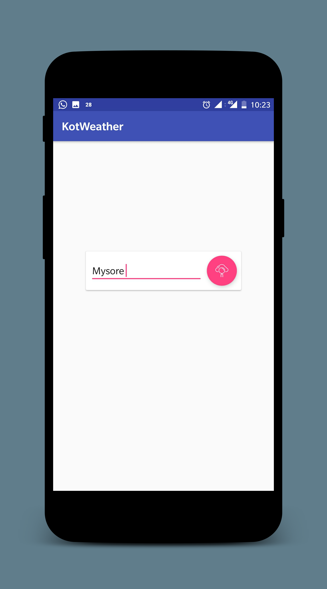
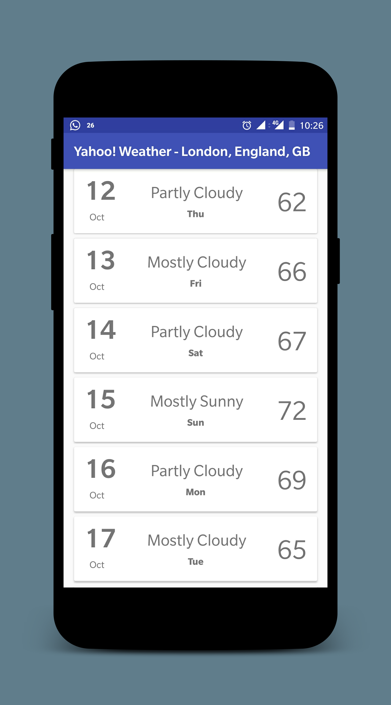

# KotWeather
> A super simple Android App written in Kotlin to fetch 10 day weather forcast for any City.

[![RetroFit Version][retro-image]][retro-url]
[![Kotlin][kotlin-image]][kotlin-url]
[![API][yahoo-image]][yahoo-url]

 

## Contributing

1. Fork it (<https://github.com/yourname/yourproject/fork>)
2. Create your feature branch (`git checkout -b feature/fooBar`)
3. Commit your changes (`git commit -am 'Add some fooBar'`)
4. Push to the branch (`git push origin feature/fooBar`)
5. Create a new Pull Request

<!-- Markdown link & img dfn's -->
[retro-image]: https://img.shields.io/badge/retrofit-v2.3.0-green.svg
[retro-url]: http://square.github.io/retrofit/
[kotlin-image]: https://img.shields.io/badge/Kotlin-v1.1.51-red.svg
[kotlin-url]: https://kotlinlang.org/
[yahoo-image]: https://img.shields.io/badge/Yahoo%20Weather-API-blue.svg
[yahoo-url]: https://developer.yahoo.com/weather/